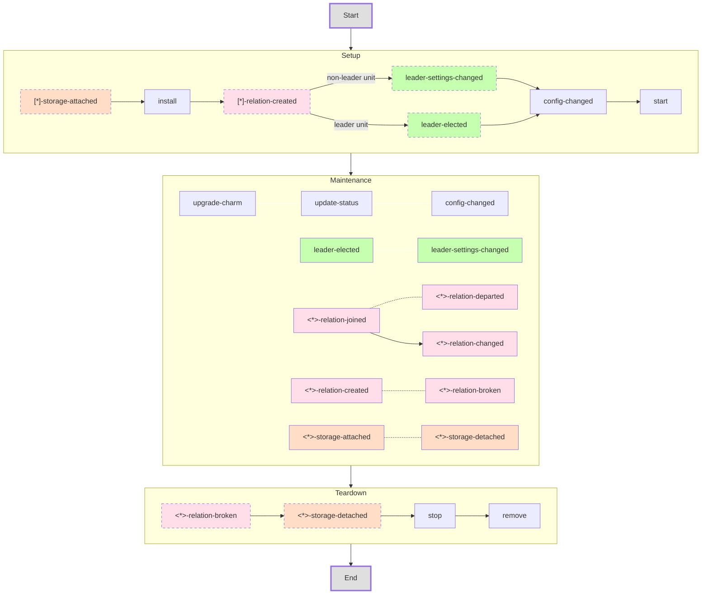

This is a temporary repository to work on the charm events graph while we find a place for it in the existing documentation or a juju repo.
It also includes some made-up notes to understanding the graph.

# The Graph

## Understanding the graph
You can read the graph as follows: when you fire up a unit, there is first a setup phase, when that is done the unit enters a maintenance phase, and when the unit goes there will be a sequence of teardown events. Generally speaking, this guarantees some sort of ordering of the events: events that are unique to the teardown phase can be guaranteed not to be fired during the setup phase. So a `stop` will never be fired before a `start`.

The obvious omission from the graph is the `<*>-pebble-ready` event, which can be fired at any time whatsoever during the lifecycle of a charm; similarly all actions and custom events can trigger hooks which can race with any other hook in the graph. Lacking a way to add them to the mermaid graph without ruining its simmetry and so as to avoid giving the wrong impression, I omitted these altogether. 

`[pre/post]-series-upgrade` machine charm events are also omitted, but these are simply part of the maintenance phase. Summary below:

### Notes on the Setup phase
* The only events that are guaranteed to always occur during Setup are `start` and `install`. The other events only happen if the charm happens to have (peer) relations at install time (e.g. if a charm that already is related to another gets scaled up) or it has storage. Same goes for leadership events. For that reason they are styled with dashed borders.
* `config-changed` occurs between `start` and `install` regardless of whether any leadership (or relation) event fires.

### Notes on the Maintenance phase
* `update-status` is fired automatically and periodically, at a configurable interval (default is 5m).
* `leader-elected` and `leader-settings-changed` only fire on the leader unit and the non-leader unit(s) respectively, just like at startup.
* There is a square of symmetries between the `*-relation-[joined/departed/created/broken]` events:
  * Temporal ordering: a `X-relation-joined` cannot *follow* a `X-relation-departed` for the same X. Same goes for `*-relation-created` and `*-relation-broken`, as well as `*-relation-created` and `*-relation-changed`.
  * Ownership: `*-relation-joined` and `*-relation-created` only fire on unit(s) that is(are) already in the relation and the unit(s) that is(are) joining respectively. Same goes for `*-relation-departed` and `*-relation-broken`
* Technically speaking all events in this box are optional, but I did not style them with dashed borders to avoid clutter. If the charm shuts down immediately after start, it could happen that no maintenance event is fired.
* A `X-relation-joined` event is always followed up (immediately after) by a `X-relation-changed` event.

### Notes on the Teardown phase
* Both relation and storage events are guaranteed to fire before `stop/remove` if the charm has storage/relations. Otherwise, only stop/remove will be fired.

# Event semantics and data
This document is only about the timing of the events; for the 'meaning' of the events, other sources are more appropriate; e.g. [juju-events](https://juju.is/docs/sdk/events).
For the data attached to an event, one should refer to the docstrings in the ops.charm.HookEvent subclass that the event you're expecting in your handler inherits from.
