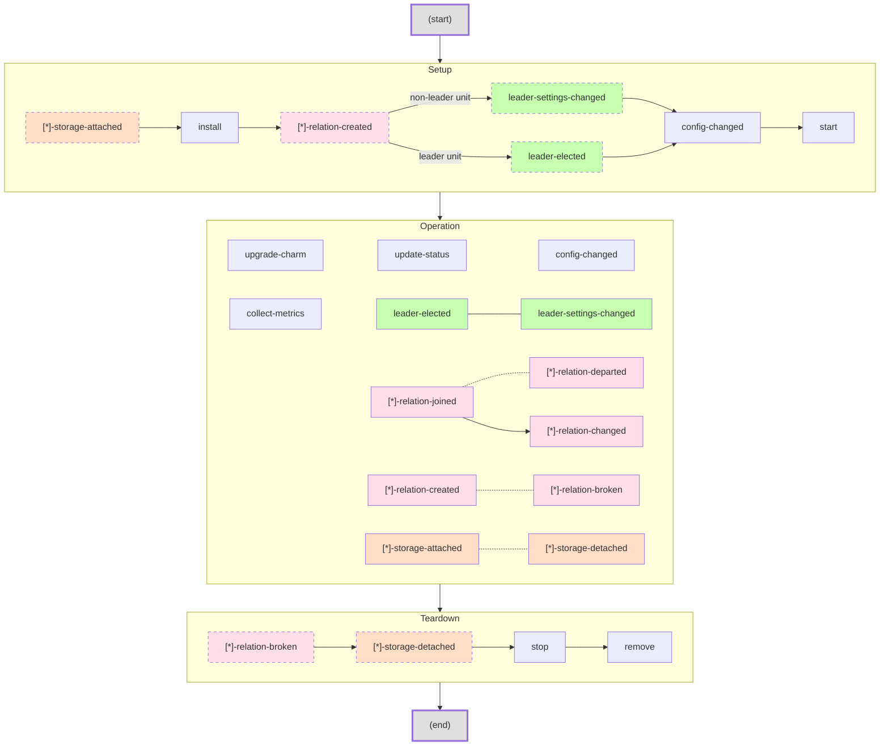
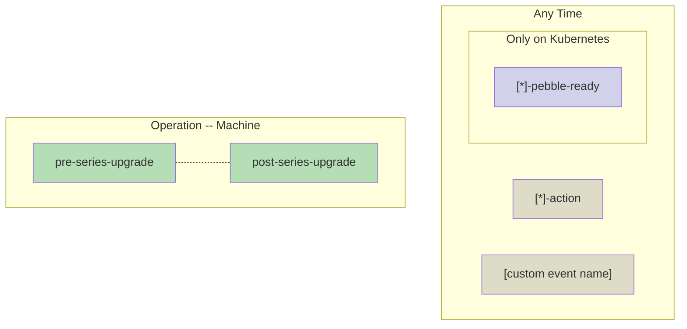
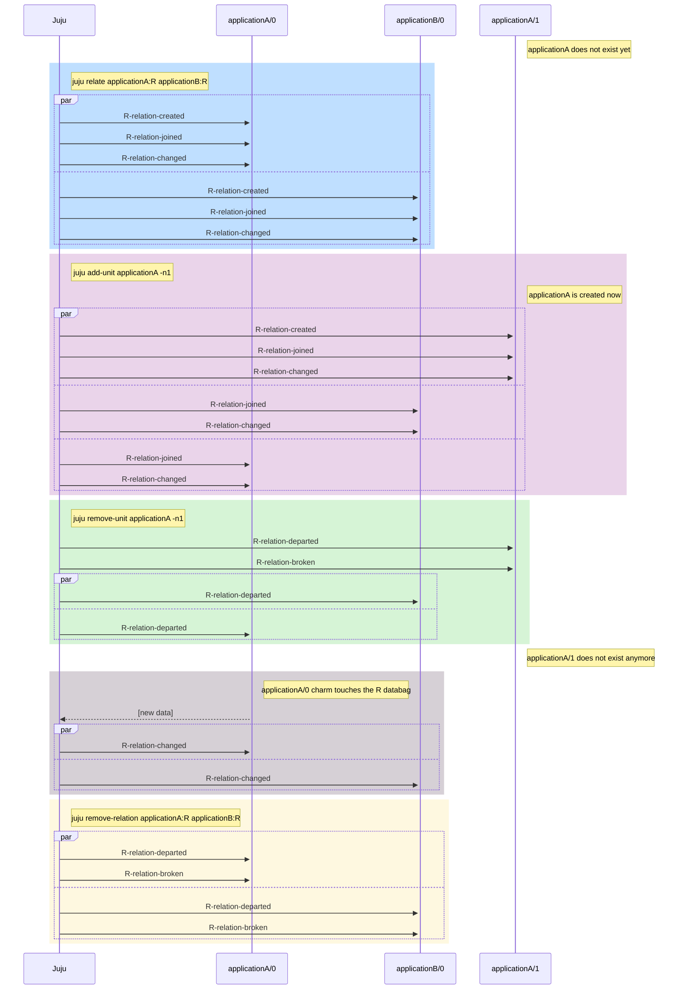
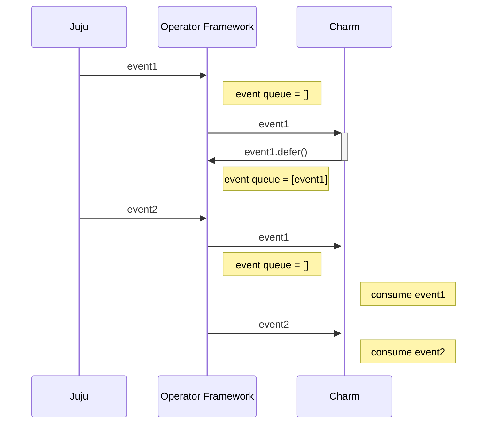
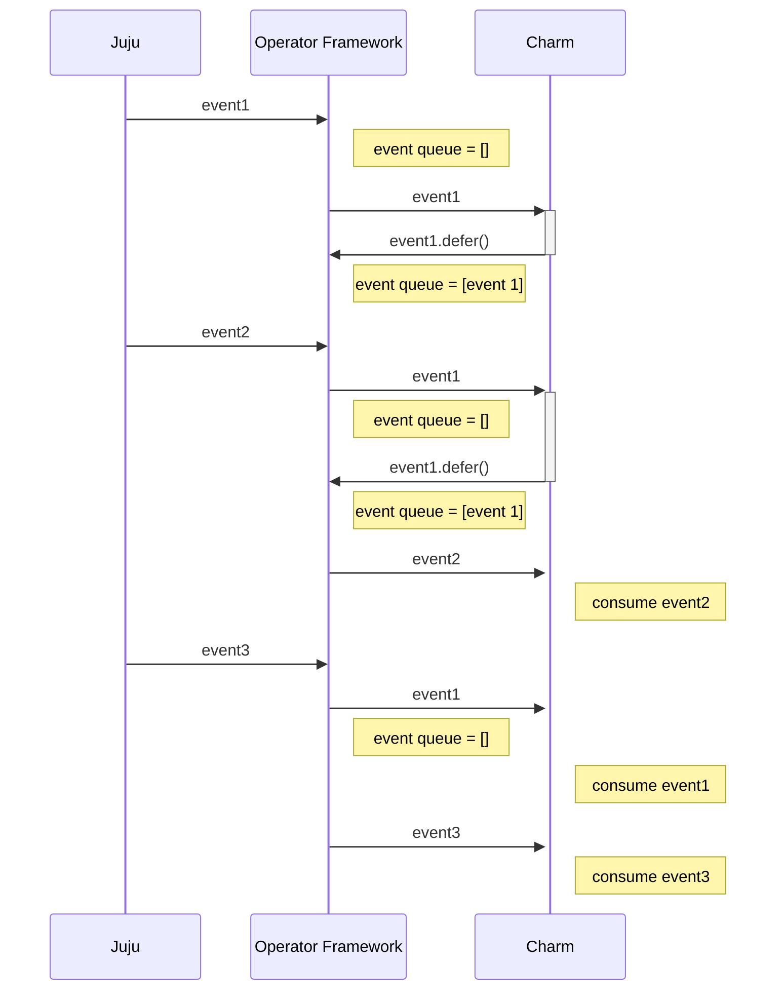

[note]This is a temporary repository to work on the charm events graph while we find a place for it in the existing documentation or a juju repo.
It also includes some made-up notes to understanding the graph.[/note]

This document is about the lifecycle of a charm, specifically the juju events that are used to keep track of it. These events, or 'hooks' to use some old terminology, are relayed to charm code by the Operator Framework in specific sequences depending on what's going on in the juju model. 

It is common wisdom that event ordering should not be generally relied upon when coding a charm, to ensure resilience. It can be however useful to understand the logic behind the timing of events, so as to avoid common mistakes and have a better picture of what is happening in your charm. In this document we'll learn how:

* A charm's lifecycle can be seen to consist of three **phases**, each one with characteristic events and sequences thereof. The fuzziest of the three being the Operation phase, where pretty much anything can happen short of setup events.
* Not all events can be reliably be assumed to occur in specific temporal orders, but some can.

In this document we will *not* learn:

* What each event means or is typically used to represent about a workload status. For that see [the sdk docs](https://juju.is/docs/sdk/events). 
* What event cascades are triggered by a human administrator running commands through the juju cli. For that see [this other doc](https://discourse.charmhub.io/t/core-lifecycle-events/4455/3).

# The Graph

### Legend
* `(start)` and `(end)` are 'meta' nodes and represent the beginning and end of the lifecycle of a Charm/juju unit. All other nodes represent hooks (events) that can occur during said lifecycle.
* Hard arrows represent strict temporal ordering which is enforced by the juju state machine and respected by the Operator Framework, which mediates between the juju controller and the Charm code.
* Dotted arrows represent a 1:1 relationship between relation events, explained in more detail down in the Operation section.
* The large yellow boxes represent broad phases in the lifecycle. You can read the graph as follows: when you fire up a unit, there is first a setup phase, when that is done the unit enters a operation phase, and when the unit goes there will be a sequence of teardown events. Generally speaking, this guarantees some sort of ordering of the events: events that are unique to the teardown phase can be guaranteed not to be fired during the setup phase. So a [`stop`] will never be fired before a [`start`].
* The colors of the event nodes represent a logical but practically meaningless grouping of the events.
  * green for leadership events
  * red for storage events
  * purple for relation events
  * blue for generic lifecycle events   

## Other events
The obvious omission from the graph above is the [`*-pebble-ready`] event, which can be fired at any time whatsoever during the lifecycle of a charm; similarly all actions and custom events can trigger hooks which can race with any other hook in the graph. Lacking a way to add them to the mermaid graph without ruining its symmetry and so as to avoid giving the wrong impression, I omitted these altogether. 

`[pre/post]-series-upgrade` machine charm events are also omitted, but these are simply part of the operation phase. Summary below:

### Notes on the Setup phase
* The only events that are guaranteed to always occur during Setup are [`start`], [`config-changed`] and [`install`]. The other events only happen if the charm happens to have (peer) relations at install time (e.g. if a charm that already is related to another gets scaled up) or it has storage. Same goes for leadership events. For that reason they are styled with dashed borders.
* [`config-changed`] occurs between [`start`] and [`install`] regardless of whether any leadership (or relation) event fires.
* Any [`*-relation-created`] event can occur at Setup time, but if X is a peer relation, then `X-relation-created` can **only** occur at Setup, while for non-peer relations, they can occur also during Operation. The reason for this is that a peer relation cannot be created or destroyed 'manually' at arbitrary times, they either exist or not, and if they do exist, then we know it from the start.

### Notes on the Operation phase
* [`update-status`] is fired automatically and periodically, at a configurable regular interval (default is 5m).
* [`collect-metrics`] is fired automatically and periodically, at a regular interval of 5m, AND whenever the user runs `juju collect-metrics`.
* [`leader-elected`] and [`leader-settings-changed`] only fire on the leader unit and the non-leader unit(s) respectively, just like at startup.
* There is a square of symmetries between the `*-relation-[joined/departed/created/broken]` events:
  * Temporal ordering: a `X-relation-joined` cannot *follow* a `X-relation-departed` for the same X. Same goes for [`*-relation-created`] and [`*-relation-broken`], as well as [`*-relation-created`] and [`*-relation-changed`].
  * Ownership: `joined/departed` are unit-level events: they fire when an application has a (peer) relation and a new unit joins or leaves. All units (including the newly created or leaving unit), will receive the event. `created/broken` are relation-level events, in that they fire when two applications become related or a relation is removed (e.g. via `juju remove-relation` or because an application is destroyed).
  * Number: there is a 1:1 relationship between `joined/departed` and `created/broken`: when a unit joins a relation with X other units, X [`*-relation-joined`] events will be fired. When a unit leaves, all units will receive a [`*-relation-departed`] event (so X of them are fired). Same goes for `created/broken` when two applications are related or a relationship is broken. Find in appendix 1 a somewhat more elaborate example.
* Technically speaking all events in this box are optional, but I did not style them with dashed borders to avoid clutter. If the charm shuts down immediately after start, it could happen that no operation event is fired.
* A `X-relation-joined` event is always followed up (immediately after) by a `X-relation-changed` event. But any number of [`*-relation-changed`] events can be fired at any time during operation, and they need not be preceded by a [`*-relation-joined`] event.
* There are more temporal orderings than the one displayed here; event chains can be initiated by human operation as detailed [in the sdk docs](https://juju.is/docs/sdk/events) and [the leadership docs](https://juju.is/docs/sdk/leadership). For example, it is guaranteed that a [`leader-elected`] is always followed by a [`settings-changed`], and that if you remove the leader unit, you should get [`*-relation-departed`] and a [`leader-settings-changed`] on the remaining units (although no specific ordering can be guaranteed [cfr this bug...](https://bugs.launchpad.net/juju/+bug/1964582)). 

### Notes on the Teardown phase
* Both relation and storage events are guaranteed to fire before [`stop`]/[`remove`] if they will fire at all. They are optional, in that a departing unit (or application) might have no storage or relations.
* [`*-relation-broken`] events in the Teardown phase are fired in case an application is being torn down. These events can also occur at Operation time, if the relation is removed by e.g. a charm or a controller.

## Caveats
* Events can be deferred by charm code by calling `Event.defer()`. That means that the event is put in a queue of deferred events which will get flushed by the operator framework as soon as the next event comes in, and *before* firing that new event in turn. See Appendix 2 for a visual representation. What this means in practice is that deferring an event can break the temporal ordering of the events as outlined in this graph; `defer()`ring an event twice will break the ordering guarantees we outlined here. Cf. the appendix for an UML-y representation. Cfr [this document on defer](https://discourse.charmhub.io/t/deferring-events-details-and-dilemmas/5930/3) for more.
* The events in the Operation phase can interleave in arbitrary ways. For this reason it's essential that hook handlers make *no assumptions* about each other -- each handler should check its preconditions independently and operate under the assumption that the relative ordering is totally arbitrary -- except relation events, which have some partial ordering as explained above.

## Deprecation notices
* [`leader-settings-changed`] is being deprecated; in a future release it will be gone.
* `leader-deposed` is a juju hook that was planned but never actually implemented. You may see a WARNING mentioning it in the `juju debug-log` but you can ignore it.

## Event semantics and data
This document is only about the timing of the events; for the 'meaning' of the events, other sources are more appropriate; e.g. [juju-events](https://juju.is/docs/sdk/events).
For the data attached to an event, one should refer to the docstrings in the ops.charm.HookEvent subclass that the event you're expecting in your handler inherits from.

# Appendices
## Appendix 1: scenario example

This is a representation of the relation events a deployment will receive in a simple scenario that goes as follows:
* We start with two unrelated applications, `applicationA` and `applicationB`, with one unit each.
* `applicationA` and `applicationB` become related via a relation called `R`.
* `applicationA` is scaled up to 2 units.
* `applicationA` is scaled down to 1 unit.
* `applicationA` touches the `R` databag (e.g. during an `update-status` hook, or as a result of a [`config-changed`], an action, a custom event...).
* The relation `R` is removed.

Note that many event sequences are marked as 'par' for *parallel*, which means that the events can be dispatched to the units arbitrarily interleaved.

## Appendix 2: deferring an event

This is the 'normal' way of using `defer()`: an event `event1` comes in but we are not ready to process it; we `defer()` it; when `event2` comes in, the OF will first flush the queue and fire `event1`, then fire `event2`. The ordering is preserved: `event1` is consumed before `event2` by the charm.

Suppose now that the charm defers `event1` again; then `event2` will be processed by the charm before `event1` is. `event1` will only be fired again once another event, `event3`, comes in in turn.
The result is that the events are consumed in the order: `2-1-3`. Beware.

<!--> LINKS PER EVENT: more information <--!>

[`install`]: https://juju.is/docs/sdk/events#heading--install
[`start`]: https://juju.is/docs/sdk/events#heading--start
[`stop`]: https://juju.is/docs/sdk/events#heading--stop
[`remove`]: https://juju.is/docs/sdk/events#heading--remove
[`*-pebble-ready`]: https://juju.is/docs/sdk/events#heading--pebble-ready
[`config-changed`]: https://juju.is/docs/sdk/events#heading--config-changed
[`update-status`]: https://juju.is/docs/sdk/events#heading--update-status
[`leader-settings-changed`]: https://discourse.charmhub.io/t/charm-hooks/1040
[`upgrade-charm`]: https://juju.is/docs/sdk/events#heading--upgrade-charm
[`*-relation-created`]: https://juju.is/docs/sdk/relations#heading--relation-events
[`*-relation-joined`]: https://juju.is/docs/sdk/relations#heading--relation-events
[`*-relation-changed`]: https://juju.is/docs/sdk/relations#heading--relation-events
[`*-relation-broken`]: https://juju.is/docs/sdk/relations#heading--relation-events

<!--> DISCOURSE POSTS: specific documentation <--!>
[`leader-elected`]: https://discourse.charmhub.io/t/leader-elected/5778
[`*-relation-departed`]: https://discourse.charmhub.io/t/relation-departed/5943

